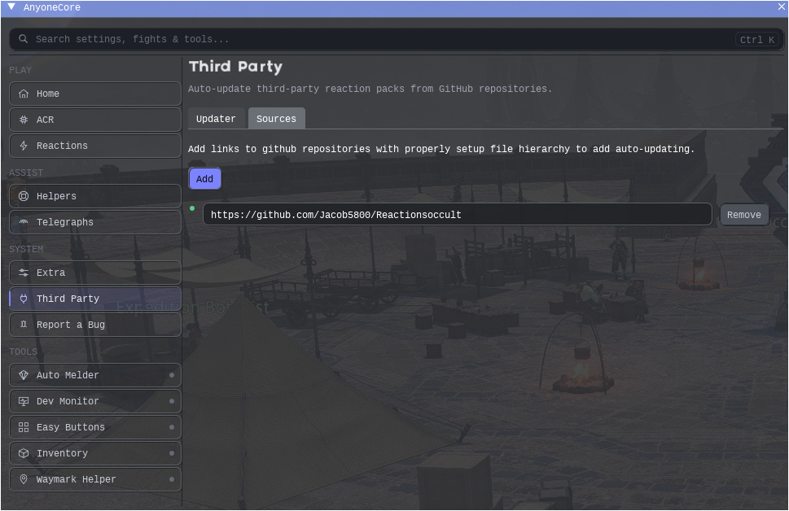

# Reactionsoccult

TensorReactions general profile for **Occult Crescent** (South Horn / North Horn).

Handles phantom job duty actions through your ACR hotbar overrides, plus Forked Tower (Blood) callouts/draws and CE telegraphs that Moogle does not cover cleanly on its own.

## Requirements

- [AnyoneCore](https://wiki.mmominion.com/doku.php?id=anyonecore)
- TensorReactions + TensorCore
- Argus
- Moogle Telegraphs
- A Tensor / Riku ACR

## Install

1. Open **AnyoneCore**
2. Go to **SYSTEM > Third Party**
3. Open the **Sources** tab
4. Hit **Add** and paste:

```
https://github.com/Jacob5800/Reactionsoccult
```

5. Switch to the **Updater** tab and update / reload so the profile shows up under TensorReactions general reactions



Folder layout after install:

```
GeneralReactions/Occult/Occult Crescent.lua
```

## How to load it

Do **not** set Occult Crescent as your only general reaction profile.

Use it as an **inherited** profile on top of a class-appropriate general / timeline reaction pack (for example one of Anyone's job general reaction profiles).

1. Open TensorReactions and select your normal job profile (Anyone Warrior, Riku MNK general, etc.)
2. Add **Occult Crescent** under that profile's inherited reactions
3. Keep your usual job reactions as the parent; Occult Crescent rides along for OC content

That way phantom-job / CE / Forked Tower logic runs while you still get the job-specific mitigation, hotbar, and fight reactions from your main profile.

## What it covers

### Phantom jobs

Duty-action automation for the OC phantom jobs: Thief, Knight, Monk, Geomancer, Bard, Chemist, Cannoneer, Samurai, Berserker, Time Mage, Oracle, Dancer, Mystic Knight, Ninja, Gladiator, White Mage, Summoner, Ranger, Dragoon, Red Mage, Necromancer, Black Mage.

Some jobs open a small UI while active (Monk kick force/block, Geomancer party levitate, Phantom WHM ST/AOE/Rez).

### Forked Tower: Blood

TTS and custom draws for the four bosses:

- Boss 1: knockback, stacks, meteor
- Boss 2: puddles, fireballs, snowball tether
- Boss 3: bubble, puddles
- Boss 4 (Magitaur): axe/lance, holy lance, daggers, blue/yellow

### Critical Engagements

Custom draws for Neo Garula Rushing Rumble, Deathclaw, Command Urn, Mythic Idol, Repaired Lion, On The Hunt, Quarried Away, Forbidden Folios, and related CEs.

## Reaction defaults worth knowing

Only a few reactions ship disabled. Everything else is on.

| Reaction | Default | Notes |
| --- | --- | --- |
| `P. Oracle Use Predict[NOT SAFE]` | off | Leave off unless you know what you are doing. Can fire Predict into lethal AoE. |
| `P. Necromancer (Disabled by def)` | off | Optional alternate. Prefer `P. Necromancer (USE on warrior)` which stays on. |
| `[OC] Weather Text Shotcall` | off | Text echo for Forked Tower weather. Sound shotcall is separate; only enable one of the two. |
| `p. Dragoon (Jump not safe)` | on | Name is the warning: jump usage is aggressive. |

`Arrow objects` tracks coffers / survey points. Its Lua has an editable name/contentid table if you want more targets. After changing that table, trigger **onwipe** under the Debug tab or reload Lua.

## Notes

- Reactions only fire while the bot is running and you are in OC maps (`1252` / `1346`).
- Phantom abilities are queued through ACR `_Hotbar_DutyActionN` flags so they weave with your rotation.
- If draws look wrong or missing, confirm Argus + Moogle Telegraphs are loaded.
